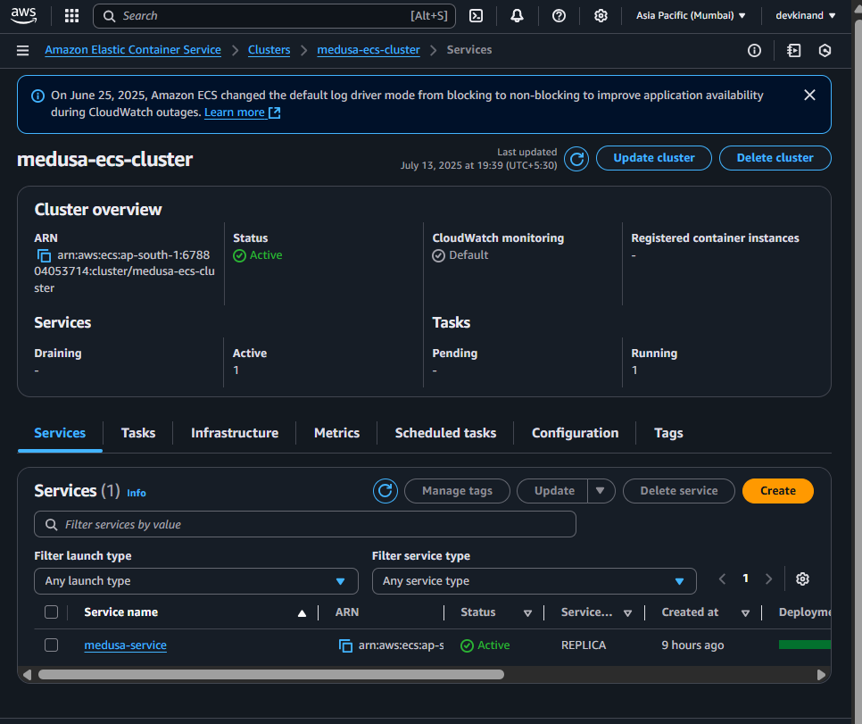
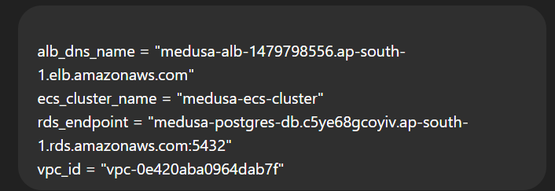
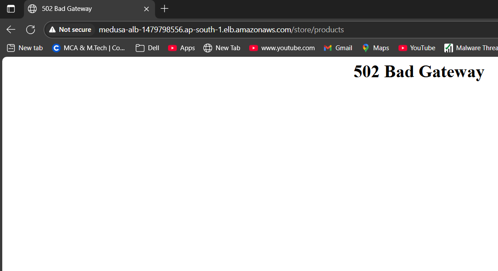

# 🚀 Medusa Headless Commerce Deployment on AWS ECS using Terraform

This project demonstrates the deployment of Medusa — a headless commerce backend — on AWS ECS Fargate using Docker, Terraform, and GitHub Actions (CI/CD).

---

## 📁 Project Structure


---

## 🧱 Infrastructure (via Terraform)

**Provisioned AWS resources:**

✅ VPC, Subnets (x2)  
✅ Internet Gateway, Route Tables  
✅ Security Groups  
✅ ECS Cluster + ECS Fargate Service  
✅ Application Load Balancer (ALB)  
✅ PostgreSQL via AWS RDS  
✅ CloudWatch Logs  
✅ ECS Task Definition with container details  

---

## ⚙️ CI/CD via GitHub Actions

CI/CD pipeline (`deploy.yml`) performs:

✅ Checkout repo  
✅ Docker login (via GitHub secrets)  
✅ Build + Push Docker image to DockerHub  
✅ Configure AWS credentials  
✅ Deploy updated ECS task definition

➡️ Triggered on: `git push` to `main` branch

---

📸 Screenshots 
 ### ✅ GitHub Actions Success


### ✅ ECS Cluster


### ✅ Terraform Output


### ✅ ALB 502 Error (Backend Reached)


## 🔐 Secrets Used in GitHub Repo

Set these GitHub secrets in your repository:

```diff
+ DOCKER_USERNAME         → DockerHub username
+ DOCKER_PASSWORD         → DockerHub access token
+ AWS_ACCESS_KEY_ID       → IAM access key (rotated)
+ AWS_SECRET_ACCESS_KEY   → IAM secret key (rotated)

+ ALB DNS: http://medusa-alb-xxxxxxxxxx.ap-south-1.elb.amazonaws.com


🙋‍♂️ Submitted by
Name: Yogesh Saini
Track: AWS Cloud Internship (Flostat / Medusa)
Date: July 2025
